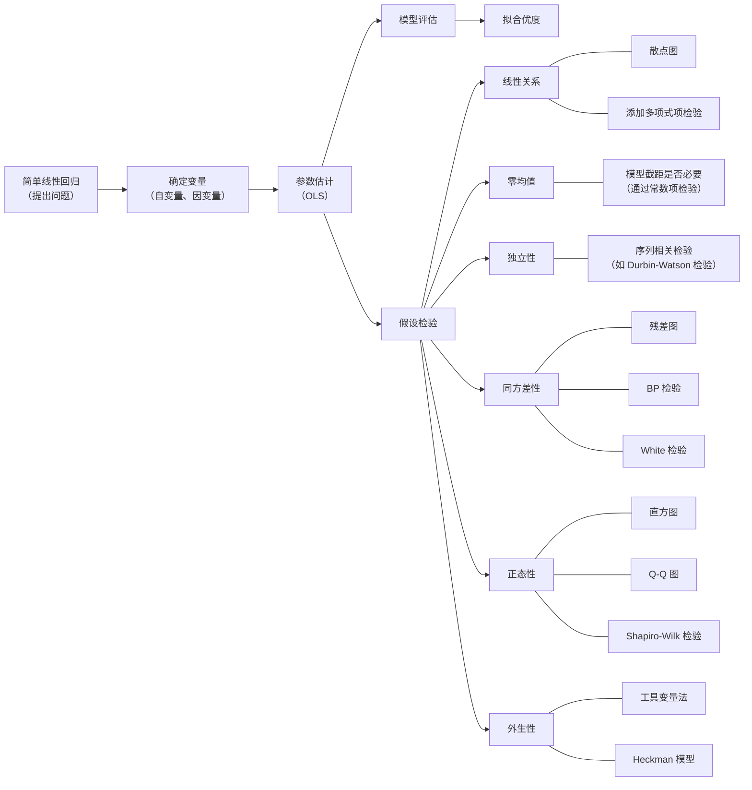
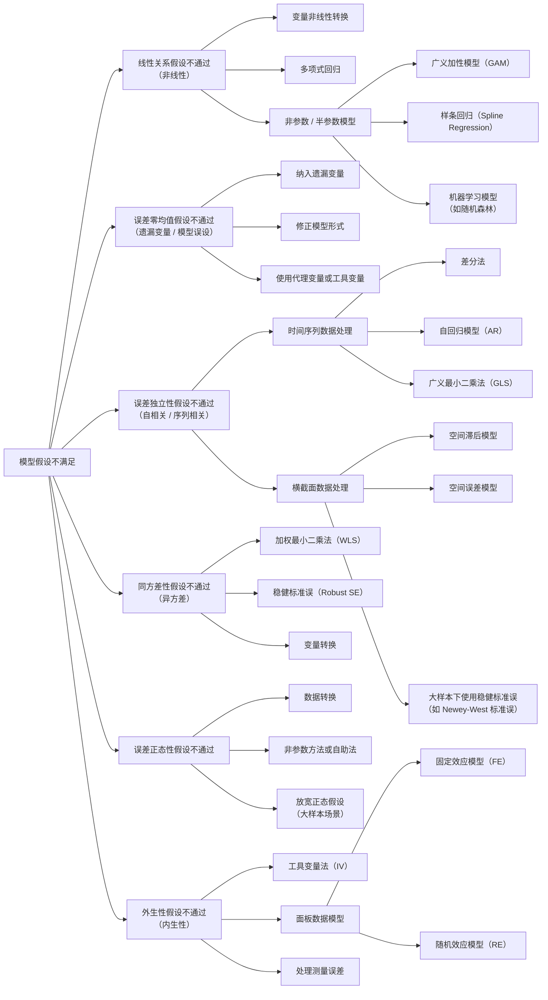

# **简单线性回归模型（Simple Linear Regression Model）**
简单线性回归（即一元线性回归）是统计学中用于分析**一个自变量（X）与一个因变量（Y）之间线性关系**的基础模型，旨在通过自变量的取值预测因变量的平均响应值。以下从定义、数学表达、假设、参数估计、模型检验、应用步骤及案例等方面详细介绍：
## **一、核心定义与数学表达式**
###  **（一） 模型目标**
假设因变量 $  Y  $ 与自变量 $  X  $ 之间存在线性关系，通过拟合直线 $  Y = \beta_0 + \beta_1 X + \varepsilon 
 $，描述 $  X  $ 对 $  Y  $ 的线性影响。
###  **（二）总体模型（理论模型）**

$ 
Y = \beta_0 + \beta_1 X + \varepsilon
$

$  \beta_0  $：截距项，表示 $  X=0  $ 时 $  Y  $ 的期望值（可能无实际意义，需结合场景）

$  \beta_1  $：斜率系数，表示 $  X  $ 每增加 1 个单位，$  Y  $ 的平均变化量（若 $  \beta_1 > 0  $ 为正相关，$  \beta_1 < 0  $ 为负相关）

$  \varepsilon  $：随机误差项，满足 $  E(\varepsilon) = 0  $，$  \text{Var}(\varepsilon) = \sigma^2  $（误差服从正态分布假设）
###  **（三）样本模型（拟合模型）**
通过样本数据 $  (X_i, Y_i), i=1,2,...,n  $ 估计参数，得到拟合方程：

$ 
\hat{Y} = \hat{\beta_0} + \hat{\beta_1} X
 $

$  \hat{Y}  $：因变量的预测值

$  \hat{\beta_0}, \hat{\beta_1}  $：$  \beta_0, \beta_1  $ 的估计值（通过最小二乘法计算）

残差（Residual）：$  e_i = Y_i - \hat{Y}_i  $，表示观测值与预测值的差异
## **二、基本假设（模型成立的前提）**
### **（一）线性关系假设（Linearity）**
**假设内容**：因变量 $  y  $ 与自变量 $  x  $ 之间存在真实的线性关系，即：

$ 
  y = \beta_0 + \beta_1 x + \epsilon
   $

其中 $\beta_0$（截距）、$\beta_1$（斜率）为未知参数，$\epsilon$ 为误差项。

**含义**：$  x  $ 对 $  y  $ 的影响是线性的，不存在二次项、指数项等非线性关系。若违反，模型会遗漏重要信息，导致参数估计偏差。

**检验方法**：

绘制 $  x  $ 与 $  y  $ 的散点图，观察是否呈直线趋势；

添加多项式项（如 $  x^2  $）检验显著性，若显著则说明非线性。
### **（二）误差项零均值假设（Zero Mean of Errors）**
**假设内容**：误差项 $\epsilon$ 的条件数学期望为 0，即对任意 $  x  $，有：

$ 
  E(\epsilon \mid x) = 0
   $

**含义**：在给定 $  x  $ 时，未被模型解释的部分（$\epsilon$）平均影响为零，说明模型已正确捕捉 $  x  $ 对 $  y  $ 的线性影响，无系统性偏差。

**违反后果**：若 $  E(\epsilon \mid x) \neq 0  $，模型截距 $\beta_0$ 估计错误，或遗漏重要解释变量。
### **（三）误差项独立假设（Independence of Errors）**
**假设内容**：不同观测值的误差项相互独立，即对任意 $  i \neq j  $，有：

$ 
  \text{Cov}(\epsilon_i, \epsilon_j) = 0
   $

**含义**：误差项之间无序列相关（时间序列数据）或空间相关（横截面数据），观测值的误差不相互影响。

**检验方法**：

时间序列数据：Durbin-Watson 检验（判断一阶自相关）；

横截面数据：观察残差图是否存在聚类或周期性模式。

**违反后果**：参数估计的标准误计算错误，导致 t 检验、F 检验失效（p 值不可靠）。
### **（四）同方差性假设（Homoscedasticity）**
**假设内容**：误差项的方差不随 $  x  $ 变化，即：

$ 
  \text{Var}(\epsilon \mid x) = \sigma^2 \quad (\sigma^2 \text{为常数})
   $

**含义**：对于所有 $  x  $ 的取值，误差项的离散程度相同，模型对不同 $  x  $ 区间的预测精度一致。

**检验方法**：

残差图：横轴为 $  x  $，纵轴为残差，观察是否有扩散 / 收敛趋势；

统计检验：Breusch-Pagan 检验、White 检验。

**违反后果**：参数估计无偏但标准误无效，假设检验结果不可靠（Type I/II 错误率上升）。
### **（五）误差项正态分布假设（Normality of Errors）**
**假设内容**：误差项 $\epsilon$ 服从正态分布，即：

$ 
  \epsilon \mid x \sim N(0, \sigma^2)
   $

**含义**：误差项的分布以 0 为中心对称，且呈钟形曲线，是小样本下假设检验（t 检验、F 检验）和置信区间估计的理论基础。

**检验方法**：

可视化：残差直方图、Q-Q 图（观察是否接近正态分布）；

统计检验：Shapiro-Wilk 检验、Kolmogorov-Smirnov 检验。

**违反后果**：小样本时检验结果不准确，大样本下因中心极限定理可放宽此假设。
### **（六）自变量无完全共线性（No Perfect Collinearity）**
**假设内容（隐含假设）**：自变量 $  x  $ 不是常数，且不存在完全线性关系（一元回归中自动满足，因只有一个自变量）。

**含义**：若 $  x  $ 为常数（所有观测值相同），则无法估计斜率 $\beta_1$，模型无意义。
### **（七）自变量外生性假设（Exogeneity）**
**假设内容**：自变量 $  x  $ 与误差项 $\epsilon$ 不相关，即：

$ 
  \text{Cov}(x, \epsilon) = 0
   $

**含义**：$  x  $ 是外生变量，其变化不依赖于未观测因素（$\epsilon$ 包含的内容），即因果关系方向明确（$  x \to y  $）。

**违反后果**：若存在内生性（如遗漏变量、测量误差、双向因果），参数估计有偏且不一致（如 OLS 估计量不收敛于真实值）。
### **假设条件总结表**
| **假设** | **数学表达**                                                  | **核心作用**      | **检验方法**                | **违反后果**         |
| ------ | --------------------------------------------------------- | ------------- | ----------------------- | ---------------- |
| 线性关系   | $  y = \beta_0 + \beta_1 x + \epsilon  $                  | 确保模型形式正确      | 散点图、添加非线性项检验            | 参数估计偏差，模型拟合不足    |
| 误差零均值  | $  E(\epsilon \mid x) = 0  $                              | 模型无系统性偏差      | 残差均值检验                  | 截距估计错误，遗漏关键变量    |
| 误差独立性  | $  \text{Cov}(\epsilon_i, \epsilon_j) = 0 \ (i \neq j)  $ | 避免误差项相关性影响标准误 | Durbin-Watson 检验、残差自相关图 | 标准误计算错误，检验失效     |
| 同方差性   | $  \text{Var}(\epsilon \mid x) = \sigma^2  $              | 保证方差稳定，标准误有效  | 残差图、BP/White 检验         | 标准误偏差，检验结果不可靠    |
| 误差正态性  | $  \epsilon \sim N(0, \sigma^2)  $                        | 支持小样本假设检验     | Q-Q 图、Shapiro-Wilk 检验   | 小样本检验失效，区间估计不准确  |
| 无完全共线性 | $  x  $ 非常数且无完全线性关系                                       | 保证参数可识别       | 自动满足（一元回归）              | 模型不可估计（仅多元回归需关注） |
| 外生性    | $  \text{Cov}(x, \epsilon) = 0  $                         | 确保因果关系无混淆     | 工具变量法、Heckman 模型        | 参数估计有偏且不一致       |
### **关键说明**
**假设的严格性**：

前四个假设（线性、零均值、独立、同方差）是模型有效性的基础，影响参数估计的无偏性和有效性；

正态性假设主要服务于统计推断，大样本下可放宽（依赖中心极限定理）。

**一元与多元回归的差异**：

一元回归无需考虑多重共线性（因只有一个自变量），但需额外关注外生性和线性关系的合理性。

通过验证上述假设，可确保回归模型的可靠性，必要时需采用修正方法（如加权最小二乘法处理异方差，工具变量解决内生性）。
## **三、当一元线性回归假设不通过时的解决策略**
若模型假设不满足，需根据具体问题针对性修正。以下是常见假设违反时的诊断与解决方法：
### **（一）线性关系假设不通过（非线性）**
#### **问题表现：**
散点图显示曲线趋势（如抛物线、指数增长）；

残差图呈现系统性弯曲（如先增后减）；

添加多项式项后系数显著（如 $  x^2  $ 的 $  p < 0.05  $）。
#### **解决方法：**
**变量非线性转换**

对 $  x  $ 或 $  y  $ 进行对数、平方、开方等变换，使关系线性化。

例：若 $  y \propto x^k  $，拟合 $  \ln y = \beta_0 + k \ln x + \epsilon  $。

**多项式回归**

引入 $  x  $ 的高次项（如二次项 $  x^2  $、三次项 $  x^3  $），模型形式：

$ 
     y = \beta_0 + \beta_1 x + \beta_2 x^2 + \cdots + \beta_k x^k + \epsilon
      $

通过显著性检验保留必要项（如仅 $  x^2  $ 显著则保留二次模型）。

**非参数 / 半参数模型**

使用广义加性模型（GAM）：$  y = \beta_0 + f(x) + \epsilon  $，其中 $  f(x)  $ 为光滑函数；

样条回归（Spline Regression）或机器学习模型（如随机森林）捕捉复杂非线性关系。
### **（二）误差零均值假设不通过（遗漏变量 / 模型误设）**
#### **问题表现：**
残差均值显著不为零（如 t 检验 $  p < 0.05  $）；

新增变量后原参数估计值变化超过 10%（存在遗漏变量偏差）。
#### **解决方法：**
**纳入遗漏变量**

通过理论分析或数据探索，识别与 $  x  $ 和 $  y  $ 均相关的变量 $  z  $，扩展模型为多元回归：

$ 
     y = \beta_0 + \beta_1 x + \beta_2 z + \epsilon
      $

例：研究 “教育年限（$  x  $” 对 “收入（$  y  $” 的影响时，遗漏 “工作经验（$  z  $” 可能导致零均值假设失效。

**修正模型形式**

检查是否遗漏交互项（如 $  x \times z  $）或函数形式错误（如应使用 $  \ln x  $ 而非 $  x  $）。

**使用代理变量或工具变量**

若无法获取真实遗漏变量，用代理变量（如 “家庭背景” 用 “父母教育程度” 代理）；

内生性场景下，采用工具变量法（IV，见外生性假设部分）。
### **（三）误差独立性假设不通过（自相关 / 序列相关）**
#### **问题表现：**
时间序列数据中，Durbin-Watson 统计量显著偏离 2（如 $  DW < 1.5  $ 或 $  DW > 2.5  $）；

残差图显示周期性模式（如连续多个正残差后连续负残差）。
#### **解决方法：**
**时间序列数据处理**

**差分法**：对 $  y  $ 或 $  x  $ 进行一阶差分（$  \Delta y_t = y_t - y_{t-1}  $），消除趋势或自相关；

**自回归模型（AR）**：引入滞后残差项，如 AR (1) 模型：

$ 
     y_t = \beta_0 + \beta_1 x_t + \rho \epsilon_{t-1} + \epsilon_t \quad (\rho \text{为自相关系数})
      $

**广义最小二乘法（GLS）**：已知自相关结构（如 AR (1)）时，通过加权修正相关性。

**横截面数据处理**

检查空间相关性（如地区数据），改用空间滞后模型或空间误差模型；

大样本下使用稳健标准误（如 Newey-West 标准误），修正自相关对标准误的影响。
### **（四）同方差性假设不通过（异方差）**
#### **问题表现：**
残差图呈 “漏斗形”（如 $  x  $ 增大时残差范围扩大）；

Breusch-Pagan 检验或 White 检验显著（$  p < 0.05  $）。
#### **解决方法：**
**加权最小二乘法（WLS）**

假设方差与 $  x  $ 的函数相关（如 $  \text{Var}(\epsilon) \propto x^2  $），赋予观测值权重 $  w_i = 1/\text{Var}(\epsilon_i)  $，最小化：

$ 
     \sum w_i (y_i - \hat{y}_i)^2
      $

权重常通过残差绝对值与 $  x  $ 的回归估计（如 $  |e_i| = \alpha_0 + \alpha_1 x_i + v_i  $）。

**稳健标准误（Robust SE）**

不改变参数估计，仅使用异方差稳健标准误（如 White 标准误），适用于大样本（$  n > 30  $）。

**变量转换**

对因变量取对数（$  \ln y  $）或平方根（$  \sqrt{y}  $），通常可缓解方差随 $  y  $ 增大而增大的问题。
### **（五）误差正态性假设不通过**
#### **问题表现：**
残差 Q-Q 图显著偏离对角线（数据点系统性高于或低于理论分位数）；

Shapiro-Wilk 检验拒绝正态分布（$  p < 0.05  $）。
#### **解决方法：**
**数据转换**

使用 Box-Cox 变换（寻找最优幂次 $  \lambda  $ 使 $  y^\lambda  $ 接近正态）；

对右偏数据取对数（$  \ln y  $），左偏数据取负对数（$  -\ln y  $）。

**非参数方法或自助法**

采用非参数回归（如局部加权回归 LOESS），不假设误差分布；

小样本时使用自助法（Bootstrap）：通过有放回抽样生成数千次样本，计算参数估计的置信区间。

**放宽正态假设（大样本场景）**

根据中心极限定理，当 $  n \geq 30  $ 时，参数估计近似正态分布，假设检验仍有效。
#### **（六）外生性假设不通过（内生性）**
#### **问题表现：**
自变量 $  x  $ 与误差项 $  \epsilon  $ 相关（如遗漏关键变量、测量误差、双向因果）；

工具变量相关性检验显著（如弱工具变量检验拒绝 “弱相关” 假设）。
#### **解决方法：**
**工具变量法（IV）**

**核心步骤**：

寻找工具变量 $  z  $，满足：

**相关性**：$  \text{Cov}(z, x) \neq 0  $（与内生变量 $  x  $ 相关）；

**外生性**：$  \text{Cov}(z, \epsilon) = 0  $（与误差项不相关）。

两阶段最小二乘法（2SLS）：

第一阶段：$  x = \pi_0 + \pi_1 z + v  $，得到预测值 $  \hat{x}  $；

第二阶段：$  y = \beta_0 + \beta_1 \hat{x} + \epsilon  $，用 $  \hat{x}  $ 替代原 $  x  $ 估计参数。

例：用 “距学校距离” 作为 “教育年限” 的工具变量（假设距学校越近，教育年限越长，且不直接影响收入）。

**面板数据模型**

若有个体或时间固定效应，使用固定效应模型（FE）或随机效应模型（RE），控制不随时间 / 个体变化的遗漏变量。

**处理测量误差**

若 $  x  $ 存在测量误差（如问卷报告偏差），通过多重插补或引入可靠性比率调整模型。
### **通用解决步骤总结**
**假设诊断**

通过残差分析（散点图、Q-Q 图）和统计检验（如 DW 检验、BP 检验）定位问题。

**优先修正核心假设**

线性关系、零均值、外生性是模型成立的前提，若违反需从模型层面调整（如增加变量、改变函数形式）。

**选择技术修正方法**

异方差 / 自相关：用 WLS、稳健标准误、GLS；

非线性：用变量转换、多项式回归、GAM；

内生性：用 IV、面板数据模型。

**重新验证假设**

修正后再次检验假设，确保新模型满足核心条件，再进行参数推断（如 t 检验、置信区间）。
### **关键原则**

**理论优先于数据**：

变量转换或模型调整需符合学科理论（如 “收入” 取对数符合边际效应递减规律），避免过度数据拟合。

**权衡方法复杂度**：

小样本：优先解决正态性（用自助法）、内生性（严格筛选工具变量）；

大样本：可接受轻微异方差 / 非正态，用稳健标准误即可。

**报告修正过程**：

明确说明原假设违反情况、修正方法及依据（如 “因存在异方差，采用 White 稳健标准误”）。

通过针对性修正，可在假设不满足时提升模型的可靠性，确保统计推断的有效性。
## **四、参数估计：最小二乘法（Ordinary Least Squares, OLS）**
目标：通过最小化  **残差平方和（SSE）**  求解 $  \hat{\beta_0}  $ 和 $  \hat{\beta_1}  $，即：

$ 
\text{SSE} = \sum_{i=1}^n e_i^2 = \sum_{i=1}^n (Y_i - \hat{Y}_i)^2 = \sum_{i=1}^n (Y_i - \hat{\beta_0} - \hat{\beta_1} X_i)^2
 $

对 $  \hat{\beta_0}  $ 和 $  \hat{\beta_1}  $ 求偏导并令导数为 0，解得：

$ 
\hat{\beta_1} = \frac{\sum_{i=1}^n (X_i - \bar{X})(Y_i - \bar{Y})}{\sum_{i=1}^n (X_i - \bar{X})^2} = \frac{\text{Cov}(X,Y)}{\text{Var}(X)}
 $

$ 
\hat{\beta_0} = \bar{Y} - \hat{\beta_1} \bar{X}
 $

其中 $  \bar{X}, \bar{Y}  $ 为样本均值
## **五、模型检验与评估**
###  **（一）拟合优度检验（Goodness-of-Fit）**
**决定系数** ：

$ 
  R^2 = \frac{\text{SSR}}{\text{SST}} = 1 - \frac{\text{SSE}}{\text{SST}}
   $

   

$  \text{SST} = \sum (Y_i - \bar{Y})^2  $：总离差平方和（数据总波动）

$  \text{SSR} = \sum (\hat{Y}_i - \bar{Y})^2  $：回归平方和（模型解释的波动）

$  \text{SSE} = \sum (Y_i - \hat{Y}_i)^2  $：残差平方和（模型未解释的波动）

$  R^2 \in [0,1]  $，值越接近 1，模型对数据的拟合效果越好
###  **（二）系数显著性检验（t 检验）**

检验假设：

$  H_0: \beta_1 = 0  $（自变量无显著影响） vs $  H_1: \beta_1 \neq 0  $

计算 t 统计量：

$ 
  t = \frac{\hat{\beta_1} - \beta_{1,0}}{SE(\hat{\beta_1})} \sim t_{n-2}
   $

其中 $  SE(\hat{\beta_1})  $ 为斜率估计值的标准误，$  \beta_{1,0}  $ 为假设的斜率值（通常为 0）

若 p 值 < 显著性水平（如 0.05），则拒绝原假设，认为自变量对因变量有显著影响
###  **（三）整体模型显著性检验（F 检验）**
检验假设：

$  H_0: \beta_1 = 0  $（模型无解释力）。

F 统计量：

$ 
  F = \frac{\text{SSR}/1}{\text{SSE}/(n-2)} \sim F_{1, n-2}
   $

在简单线性回归中，F 检验与 t 检验对斜率的结果等价（因仅有一个自变量）
### **（四）残差分析（假设检验）**
**残差图（Residual Plot）**：绘制残差 vs 自变量或预测值，检查是否存在异方差（漏斗形）或非线性趋势（曲线形）

**正态概率图（Q-Q Plot）**：检验残差是否近似正态分布（点应接近对角线）

**Durbin-Watson 检验**：检测自相关性（时间序列数据中常用）
## **六、应用步骤**
**数据准备**

收集自变量 $  X  $ 和因变量 $  Y  $ 的成对数据，确保数据无严重异常值。

**模型拟合**

使用 OLS 计算截距 $  \hat{\beta_0}  $ 和斜率 $  \hat{\beta_1}  $，得到拟合方程 $  \hat{Y} = \hat{\beta_0} + \hat{\beta_1} X  $。

**假设检验**

通过 t 检验验证斜率 $  \beta_1  $ 的显著性，通过残差图检查线性、方差齐性和正态性假设。

**模型评估**

计算 $  R^2  $ 评估拟合优度，结合业务场景判断模型是否合理。

**预测与解释**

给定 $  X  $ 的新值，计算 $  \hat{Y}  $ 作为预测值；解释斜率 $  \hat{\beta_1}  $ 的实际意义（如 “X 每增加 1 单位，Y 平均增加 / 减少$  \hat{\beta_1}  $单位”）。
## **七、案例：身高与体重的关系**
**数据**：收集 10 名成年人的身高（$  X  $，单位：cm）和体重（$  Y  $，单位：kg），数据如下：

| 身高 $  X  $ | 160 | 165 | 170 | 175 | 180 | 155 | 162 | 168 | 172 | 185 |
| :----: | :----: | :----: | :----: | :----: | :----: | :----: | :----: | :----: | :----: | :----: |
| 体重 $  Y  $ | 50  | 55  | 60  | 65  | 70  | 45  | 52  | 58  | 62  | 75  |

**步骤**：

计算均值：

$  \bar{X} = 170  $，$  \bar{Y} = 59.2  $。

计算斜率 $  \hat{\beta_1}  $：

$ 
   \hat{\beta_1} = \frac{\sum (X_i - 170)(Y_i - 59.2)}{\sum (X_i - 170)^2} = \frac{1020}{1450} = 0.7034
    $

计算截距 $  \hat{\beta_0}  $：

$ 
   \hat{\beta_0} = 59.2 - 0.7034 \times 170 = -50.378
    $

拟合方程：

$  \hat{Y} = -50.378 + 0.7034X  $

解释：身高每增加 1cm，体重平均增加约 0.7034kg；截距表示身高为 0cm 时的体重预测值（无实际意义，因身高不可能为 0）。

计算 $  R^2 = 0.98  $，说明模型解释了 98% 的体重变异，拟合效果极佳。
## **八、局限性**
**单变量限制**：仅能分析一个自变量与因变量的关系，实际问题常需多元回归

**线性假设**：若真实关系非线性，模型会失效（需通过残差图或非线性变换检验）

**相关性≠因果性**：模型仅描述关联，无法证明因果关系（需结合理论或实验设计）

**异常值敏感**：OLS 对极端值较敏感，需预处理或使用稳健方法（如加权最小二乘）
## **九、拓展**
**加权线性回归**：处理异方差数据（给方差小的观测值更高权重）。

**对数线性回归**：对 $  X  $ 或 $  Y  $ 取对数，转换为线性关系（如幂函数模型 $  Y = aX^b  $ 可通过对数转换为 $  \ln Y = \ln a + b \ln X  $）。

**虚拟变量**：引入分类自变量（如性别、地区），扩展模型应用场景。

